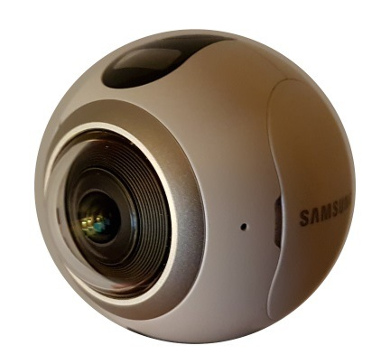

# About

Simple script to create equirectangular panoramic photos or videos from Samsung Gear 360. It supports
generation 1 (SM-C200) and 2 (2017 or SM-R210).



# Latest Changes

Latest Changes:

- 2018-02-18: splitted scripts into Windows and Linux part (.cmd, .sh), updated
pannellum library, fixed problem with xargs. Added support for 4096 (gen2?) videos.
Fixed problem with bad output video length. Note: Windows version not tested.
- 2017-10-04: added ```-p``` option for parallel video stitching (contribution by kwahoo2).
On some machines it should greatly reduce video stitching time (ex. 33 s vs ~13 s). Use
with care, might freeze your machine. Added ```-r``` option for panorama processing, it
will remove source file (this used by video processing to save on disk space).
- 2017-10-01: higher quality video output by default (override with ```--speed``` option), ability to
set temporary directory for video, added 2k video support (contribution by durkie), few fixes, added
tests for panorama and video (can be used as primitive performance mesaurement). Important: Linux
changes only, Windows should, hopefully, follow later.
- 2017-07-11: fixed video script to work with new panorama script, fix when run outside script directory
(video script still might have problems), GPU used by default, ability to set temporary directory (not
for videos yet), video stitching uses [multiblend](http://horman.net/multiblend/) by default (no option to
disable yet).
- 2017-07-09: processed files (in output directory) are skipped, [multiblend](http://horman.net/multiblend/) support,
use GPU when possible by default, updated help.
- 2017-06-11: added preliminary support for generation 2 of Gear360 (SM-R210), thanks sfrique for providing files.
- 2017-06-10: support for wildcards, switched gallery to Pannellum, "automatic" gallery creation, no longer possible to set output filename (this is due to acceptance of wildcards/multiple files).
Lots of changes so expect things not to work well (I did basic testing).
- 2017-05-16: small update, added poorman's gallery in html.
- 2017-03-17: added compatibility with Google Photos (contribution by Ry0 and ftoledo).
- 2017-02-04: added tutorial how to manually create initial panorama in Hugin, updated template, now it resembles panorama created by Samsung S7 phone (it is horizontally rotated by 180 deg.).
- 2017-01-25: added EXIF data to output file, Windows has now command timing, cosmetic changes to the file.
- 2017-01-18: improved Hugin template(s), should not be so distorted; new template for video, should speed up video by factor of two (about), fix video size for Linux in script (was 1940, should be 1920).
- 2016-11-07: added sound to final video (contribution by OWKenobi), some small fixes.
- 2016-10-23: experimental (read: slow and not tested well) support for video stiching.
- 2016-09-29: removed bash dependency on Windows, one script for Linux & Windows, script can be run outside its original/installation directory.
- 2016-07-31: removed dependency on ImageMagick, optional second parameter as output filename.

# Usage

## Requirements

Requirements:

* Linux, Windows, should work on Mac.
* [Hugin](http://hugin.sourceforge.net/).
* [ffmpeg](https://ffmpeg.org/download.html) (optional, needed for video stitching).
* [multiblend](http://horman.net/multiblend/) (optional, needed for video stitching).
* [GNU Parallel](https://www.gnu.org/software/parallel/) (optional, needed for video stitching if using ```-p``` option).

## Installation

### Linux

Use your distributions' package manager to install [Hugin](http://hugin.sourceforge.net/). Example for Ubuntu:

    apt-get install hugin

Do the same for ```ffmpeg``` if you want video stitching, it is usually installed by default on many Linux distributions.

[multiblend](http://horman.net/multiblend/) is a bit more tricky. In most cases you will have to manually
compile it and install. After unpacking read ```build.txt```... or do this:

    unzip multiblendX.Y.Z.zip
    cd multiblend
    g++ -msse2 -O3 -ltiff -ltiffxx -ljpeg -lpng multiblend.cpp -o multiblend
    # If that fails try this instead (older g++):
    # g++ -msse2 -O3 multiblend.cpp -o multiblend -ltiff -ltiffxx -ljpeg -lpng
    sudo cp multiblend /usr/local/bin

Package exists for [Arch Linux](https://aur.archlinux.org/packages/multiblend/).

[GNU Parallel](https://www.gnu.org/software/parallel/) is needed if using ```-p``` option
(greatly speeds-up processing). It is a standard package that can be installed
using your package manager, example:

    apt-get install parallel

Finally: clone or download zip of this project then unpack it somewhere.

One liner to install it in current directory under ```gear360pano``` (no ```.git``` dir):

    mkdir -p gear360pano && wget -qO- https://github.com/ultramango/gear360pano/archive/master.zip | bsdtar -xvf- -C gear360pano -s'|[^/]*/||' > /dev/null 2>&1 && find gear360pano -iname "*.cmd" -exec chmod a+x {} \; && echo '\nDone'

### Windows

Install [Hugin](http://hugin.sourceforge.net/) in the default location (it's hardcoded in script),
both 32 and 64-bit versions will work.

For video stitching install/unzip [ffmpeg](https://ffmpeg.zeranoe.com/builds/) in ```c:\program files\ffmpeg```
(there should be a subdirectory ```bin``` there with ```ffmpeg.exe``` binary).

For [multiblend](http://horman.net/multiblend/) support you need to unpack it into Hugin ```bin```
directory: ```c:\program files\hugin\bin```.

Clone or download zip of this project then unpack it somewhere.

## Usage

### Photos

Open console or command line (Win key + R then ```cmd.exe```), go to directory where you cloned/unpacked this project.

Usage (example for Linux, for Windows use ```gear360pano.cmd```):

    gear360pano.sh *.JPG

    # For Linux and GNU Parallel
    ls -1 path/to/files/*.JPG | parallel --load 99% --noswap --memfree 500M --bar ./gear360pano.sh {}

Output (example for Linux, for Windows use ```gear360pano.cmd```):

    $./gear360pano.sh 360_0010.JPG
    Processing file: 360_0010.JPG
    Processing input images (nona)
    nona: using graphics card: NVIDIA Corporation GeForce GTX 1080/PCIe/SSE2
    Stitching input images
    enblend: warning: option "--gpu" has no effect in this enblend binary,
    enblend: warning: because enblend was compiled without support for OpenCL
    enblend: info: loading next image: /tmp/tmp.b7JjFwkWAV/out0000.tif 1/1
    enblend: info: loading next image: /tmp/tmp.b7JjFwkWAV/out0001.tif 1/1
    enblend: info: writing final output
    enblend: warning: must fall back to export image without alpha channel
    Setting EXIF data (exiftool)
    Processing took: 10 s
    Processed files are in /somedir/gear360pano/html/data

This will produce a panorama files in ```html\data``` directory (default), this can be
changed with -o (Linux) or /o (Windows) paramter.

List of switches (Windows in brackets):

* -a (/a) - enforce processing of all files (default: skip already processed)
* -g (/g) - update gallery files list (default: do not update gallery files list)
* -m (/m) - use multiblend instead of Hugin's enblend (faster but lower quality)
* -n (/n) - do not use GPU (slower but safer)
* -o (/o) directory - set output directory (default: html/data)
* -q (/q) quality - set JPEG quality (default: 97)
* -r - remove source file after processing (use with care)
* -t (/t) directory - set temporary directory (default: systems' default)
* -h (/h) - display help

Script has some simple error checking routines but don't expect it will handle all bad situations.

Few remarks (does not apply for the videos):

* script currently supports only the highest resolution from the camera (7776x3888),
* ensure that you have something like 150 MB of free disk space for intermediate files. If you're tight
on disk space, switch to png format (change inside the script), but the processing time increases about four times,
* on Intel i7, 16 GB memory, NVIDIA 1080 it takes ~10 seconds to produce the panorama (using enblend),
* for better results stitch panorama manually: create new project in Hugin, add two times the same (raw)
panorama file, then choose from menu "File" and "Apply Template", add points and optimise,
* script might contain bugs, most possibly running script from weird directories (symbolic links, spaces
in paths) or giving image from just as weird directory location,
* script might not support some exotic interpreters or not work on some older Windows versions. On Linux
it works with bash,
* you might need to escape asterisk, otherwise script might/will hang,
* script has (should have) Unix line endings (this might cause problems with labels under Windows, so far - not).

### Videos

For videos (example for Linux):

    ./gear360video.sh video.mp4

This should produce ```video_pano.mp4``` in ```html/data``` directory (default), output file can be
given as a second argument (but not full path, see ```-o``` parameter).

List of switches (Linux):

* -o directory - place stitched video in directory
* -p - use GNU Parallel to process frames in parallel (speeds things up)
* -s - optimise stitching for speed (quality will suffer)
* -t directory - place temporary files in directory
* -h - display help

What is/might be wrong (loose notes about the script):

* to speed-up stitching [multiblend](http://horman.net/multiblend/) is used, it means you have to install it,
* video stitching works by converting it to image files, stitching them and then re-coding, it might
require a lot of disk space (gigabytes or even more) as the long videos will result in many image
files,
* ```-p``` option might be pretty resource hungry, your machine might slow down or freeze,
use with care,
* timelapse videos are not (yet?) supported under Windows (problems with sound).

# Tutorial

This video shows how to create an initial (no proper stitching) panorama file from one double fisheye photos:

[](http://www.youtube.com/watch?v=QKQGT8VUN8g "Panorama from double fisheye photo")

# Links

Links:
* easy to setup HTML panorama viewer [Pannellum](https://pannellum.org/),
* panorama photo and video viewer: [Valiant360](https://github.com/flimshaw/Valiant360),
* faster enblend substitute: [multiblend](http://horman.net/multiblend/),
* some notes on [Gear360 firmware](https://github.com/ultramango/gear360reveng).

# TODOs

Few TODOs:

* support more image sizes, not only 7k,
* use GNU Parallel if more than one panorama is being stitched,
* there's no vignetting correction, better lens correction could be created.
